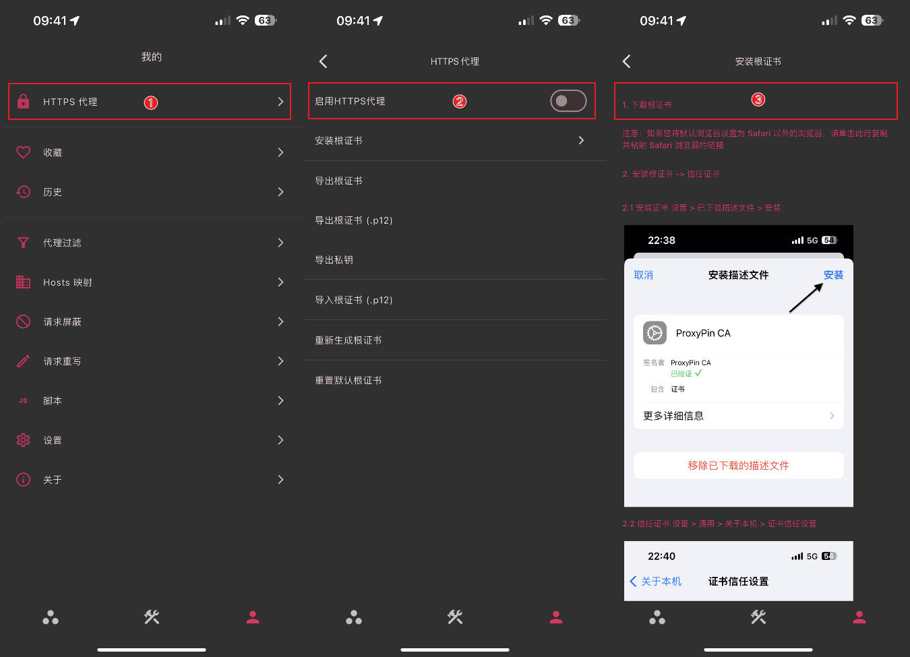
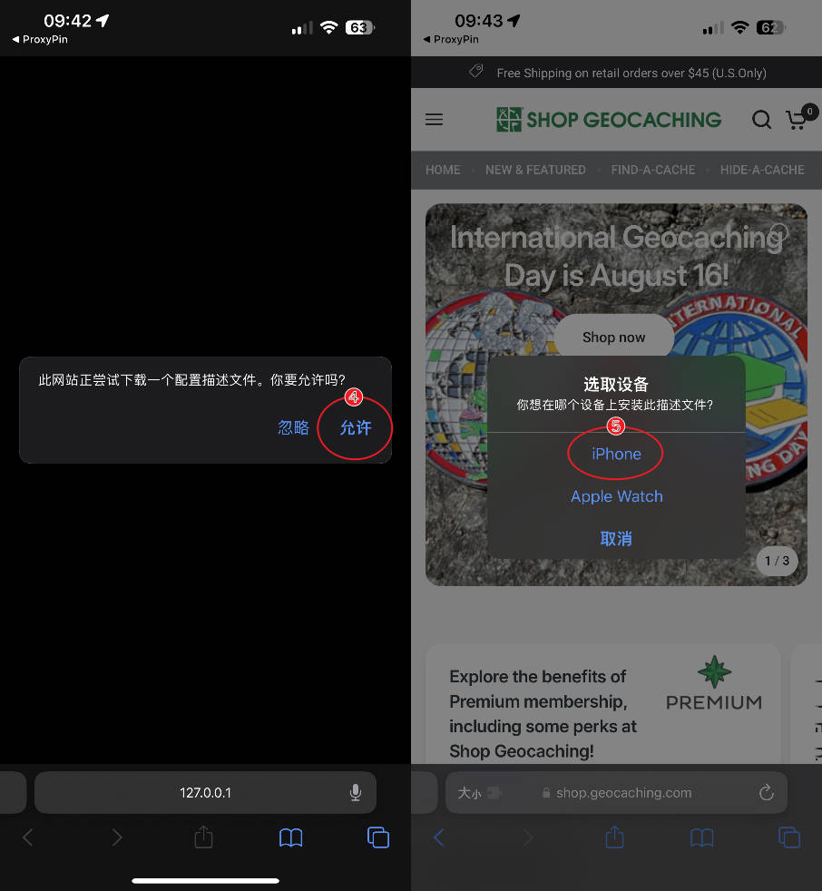
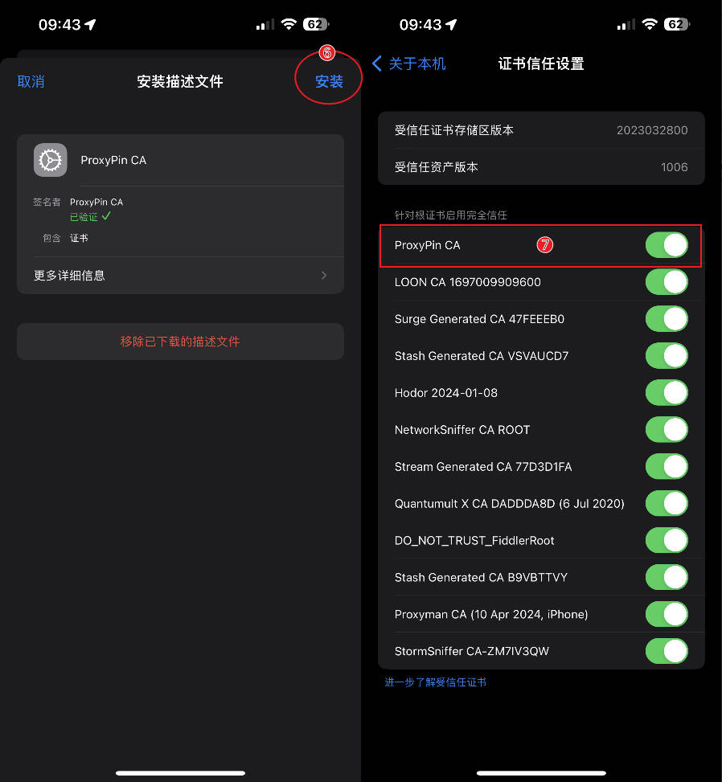
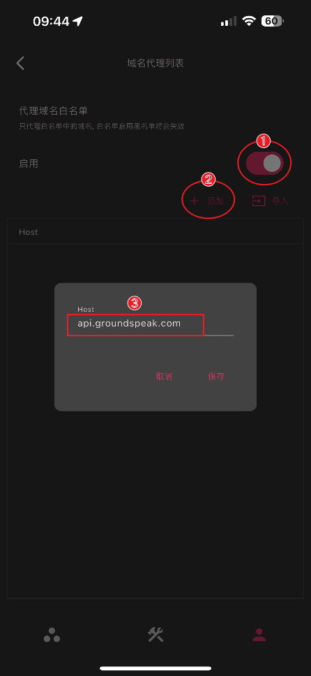
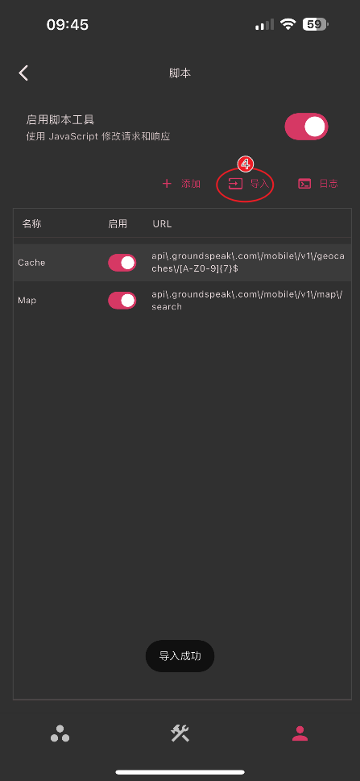
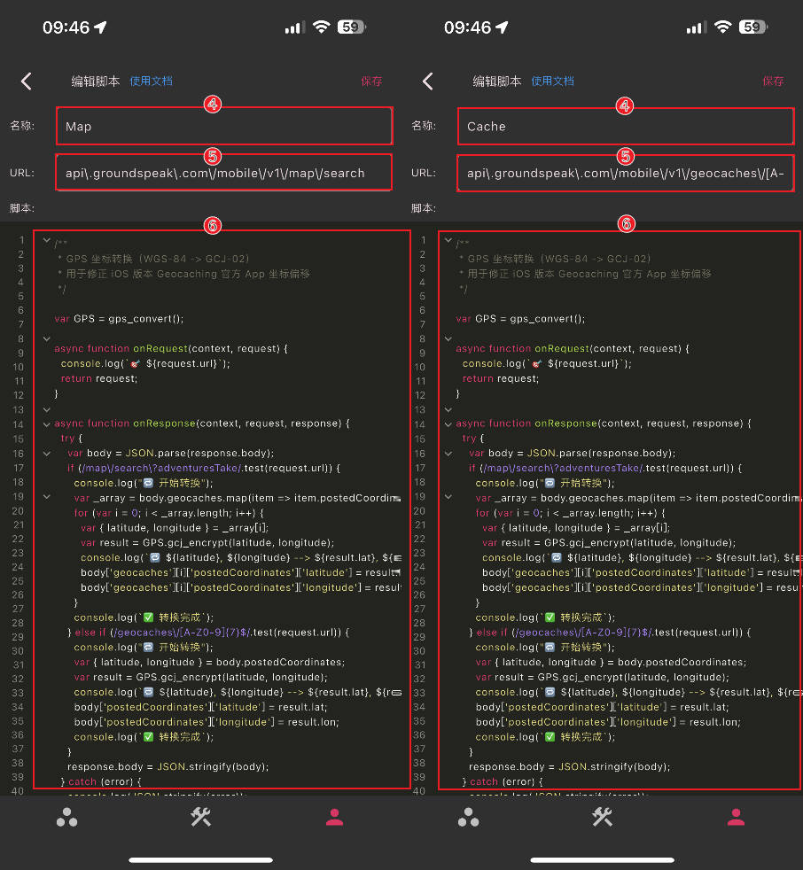
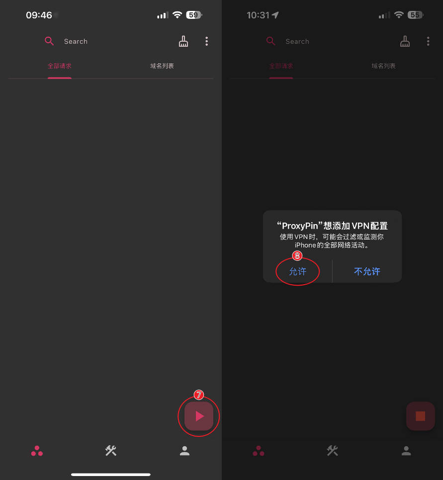
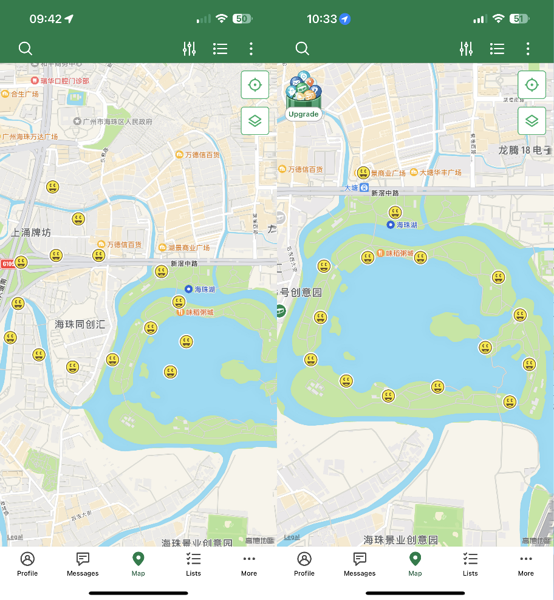

# 通过「ProxyPin」App 修正 iOS 版本 Geocaching 应用在中国大陆的坐标偏移问题

在中国大陆，由于某些原因，地图服务使用的坐标系是 GCJ-02（火星坐标系），Geocaching iOS 版本官方 App 获取的坐标是 WGS84 坐标系，导致在高德地图上显示会出现位置偏移问题。

## 工作原理：

利用 **ProxyPin** App 作为中间人代理拦截网络请求，使用 JavaScript 脚本提取 cache 的原始 WGS84 坐标并转换为 GCJ-02 坐标，修改响应体后返回给应用。

## 设备兼容：

此方法支持 iOS 12 / iPadOS 12 或以上版本的 iPhone 或 iPad 设备使用。

## 操作步骤

### 环境准备

1. 在 App Store 安装 [ProxyPin](https://apps.apple.com/app/id6450932949) 应用；

   

2. 安装并信任 ProxyPin 的 CA 根证书（用于 HTTPS 解密）;

   

3. 安装证书后，**进入【通用】-【关于手机】-【证书信任设置】找到 `ProxyPIn CA` 的证书进行信任；**

   

### 代理配置

1. 添加代理域名白名单；

   Host：`api.groundspeak.com`

   

2. 添加/导入 JavaScript 脚本；

   #### 方法 ➊：通过文件导入：

   - 下载脚本文件：[下载地址](https://wwbz.lanzouw.com/i3C0h338j0la)
   - 解压后，点击导入 `Geocaching-proxypin-scripts.json` 文件;

   

   ***

   #### 方法 ➋：通过代码添加：

   - 名称 ①：`Cache`
   - URL①：`api\.groundspeak\.com\/mobile\/v1\/geocaches\/[A-Z0-9]{7}$`
   - 名称 ②：`Map`
   - URL②：`api\.groundspeak\.com\/mobile\/v1\/map\/search`
   - 脚本：

            /**
             * GPS 坐标转换（WGS-84 -> GCJ-02）
             * 用于修正 iOS 版本 Geocaching 官方 App 坐标偏移
             */

            var GPS = gps_convert();

            async function onRequest(context, request) {
              console.log(`🎯 ${request.url}`);
              return request;
            }

            async function onResponse(context, request, response) {
              try {
                var body = JSON.parse(response.body);
                if (/map\/search\?adventuresTake/.test(request.url)) {
                  console.log("🔁 开始转换");
                  var _array = body.geocaches.map(item => item.postedCoordinates);
                  for (var i = 0; i < _array.length; i++) {
                    var { latitude, longitude } = _array[i];
                    var result = GPS.gcj_encrypt(latitude, longitude);
                    console.log(`🔁 ${latitude}, ${longitude} --> ${result.lat}, ${result.lon}`);
                    body['geocaches'][i]['postedCoordinates']['latitude'] = result.lat;
                    body['geocaches'][i]['postedCoordinates']['longitude'] = result.lon;
                  }
                  console.log(`✅ 转换完成`);
                } else if (/geocaches\/[A-Z0-9]{7}$/.test(request.url)) {
                  console.log("🔁 开始转换");
                  var { latitude, longitude } = body.postedCoordinates;
                  var result = GPS.gcj_encrypt(latitude, longitude);
                  console.log(`🔁 ${latitude}, ${longitude} --> ${result.lat}, ${result.lon}`);
                  body['postedCoordinates']['latitude'] = result.lat;
                  body['postedCoordinates']['longitude'] = result.lon;
                  console.log(`✅ 转换完成`);
                }
                response.body = JSON.stringify(body);
              } catch (error) {
                console.log(JSON.stringify(error));
              } finally {
                return response;
              }
            }

            function gps_convert() {
              return { PI: 3.141592653589793, x_pi: 52.35987755982988, delta: function (t, a) { var n = 6378245, h = .006693421622965943, i = this.transformLat(a - 105, t - 35), s = this.transformLon(a - 105, t - 35), r = t / 180 * this.PI, o = Math.sin(r); o = 1 - h * o * o; var M = Math.sqrt(o); return { lat: i = 180 * i / (n * (1 - h) / (o * M) * this.PI), lon: s = 180 * s / (n / M * Math.cos(r) * this.PI) } }, gcj_encrypt: function (t, a) { if (this.outOfChina(t, a)) return { lat: t, lon: a }; var n = this.delta(t, a); return { lat: t + n.lat, lon: a + n.lon } }, gcj_decrypt: function (t, a) { if (this.outOfChina(t, a)) return { lat: t, lon: a }; var n = this.delta(t, a); return { lat: t - n.lat, lon: a - n.lon } }, gcj_decrypt_exact: function (t, a) { for (var n, h, i = .01, s = .01, r = t - i, o = a - s, M = t + i, e = a + s, c = 0; ;) { n = (r + M) / 2, h = (o + e) / 2; var l = this.gcj_encrypt(n, h); if (i = l.lat - t, s = l.lon - a, Math.abs(i) < 1e-9 && Math.abs(s) < 1e-9) break; if (i > 0 ? M = n : r = n, s > 0 ? e = h : o = h, ++c > 1e4) break } return { lat: n, lon: h } }, bd_encrypt: function (t, a) { var n = a, h = t, i = Math.sqrt(n * n + h * h) + 2e-5 * Math.sin(h * this.x_pi), s = Math.atan2(h, n) + 3e-6 * Math.cos(n * this.x_pi); return bdLon = i * Math.cos(s) + .0065, bdLat = i * Math.sin(s) + .006, { lat: bdLat, lon: bdLon } }, bd_decrypt: function (t, a) { var n = a - .0065, h = t - .006, i = Math.sqrt(n * n + h * h) - 2e-5 * Math.sin(h * this.x_pi), s = Math.atan2(h, n) - 3e-6 * Math.cos(n * this.x_pi), r = i * Math.cos(s); return { lat: i * Math.sin(s), lon: r } }, mercator_encrypt: function (t, a) { var n = 20037508.34 * a / 180, h = Math.log(Math.tan((90 + t) * this.PI / 360)) / (this.PI / 180); return { lat: h = 20037508.34 * h / 180, lon: n } }, mercator_decrypt: function (t, a) { var n = a / 20037508.34 * 180, h = t / 20037508.34 * 180; return { lat: h = 180 / this.PI * (2 * Math.atan(Math.exp(h * this.PI / 180)) - this.PI / 2), lon: n } }, distance: function (t, a, n, h) { var i = Math.cos(t * this.PI / 180) * Math.cos(n * this.PI / 180) * Math.cos((a - h) * this.PI / 180) + Math.sin(t * this.PI / 180) * Math.sin(n * this.PI / 180); return i > 1 && (i = 1), i < -1 && (i = -1), 6371e3 * Math.acos(i) }, outOfChina: function (t, a) { return a < 72.004 || a > 137.8347 || (t < .8293 || t > 55.8271) }, transformLat: function (t, a) { var n = 2 * t - 100 + 3 * a + .2 * a * a + .1 * t * a + .2 * Math.sqrt(Math.abs(t)); return n += 2 * (20 * Math.sin(6 * t * this.PI) + 20 * Math.sin(2 * t * this.PI)) / 3, n += 2 * (20 * Math.sin(a * this.PI) + 40 * Math.sin(a / 3 * this.PI)) / 3, n += 2 * (160 * Math.sin(a / 12 * this.PI) + 320 * Math.sin(a * this.PI / 30)) / 3 }, transformLon: function (t, a) { var n = 300 + t + 2 * a + .1 * t * t + .1 * t * a + .1 * Math.sqrt(Math.abs(t)); return n += 2 * (20 * Math.sin(6 * t * this.PI) + 20 * Math.sin(2 * t * this.PI)) / 3, n += 2 * (20 * Math.sin(t * this.PI) + 40 * Math.sin(t / 3 * this.PI)) / 3, n += 2 * (150 * Math.sin(t / 12 * this.PI) + 300 * Math.sin(t / 30 * this.PI)) / 3 } };
            }
     
3. 开启代理配置

     9

## 教程结束 Enjoy !

> #### 让地理寻宝重拾精准，从此告别坐标偏移
>
> 希望通过此教程，可以帮助大家更好的探索身边的每一个宝藏。

---

### 免责声明：

1. 本仓库发布的代码，包括其中涉及的任何解密分析代码，仅供学术研究和参考学习，禁止用于商业或非法用途。由于代码可能存在的法律性、准确性、有效性问题，用户应自行做出判断，并自行承担可能产生的所有风险，本人对此不承担任何保证责任。
2. 若本仓库代码涉及到的任何应用或平台与本人无关。本人不对因使用该代码可能导致的任何隐私泄漏或其他后果承担责任。此外，对于本仓库代码可能引起的任何问题，包括但不限于由代码错误导致的任何损失或损害，本人亦不承担任何责任。
3. 本仓库的所有内容仅供学习研究，用户下载后必须在 24 小时内将所有内容从设备上完全删除。若有任何违反此规定所引起的后果，本人不承担任何责任。
4. 如有任何单位或个人认为本仓库所提供的代码可能侵犯其权利，应及时提供身份证明及所有权证明并以书面形式通知我们。收到证明文件确认后，我们将尽快删除相关内容。
5. 任何直接或间接访问、使用或复制本仓库代码的人，必须仔细阅读并理解此声明。本人保留随时更新或补充此免责声明的权利，一旦您访问或使用了本仓库，即表示您已经阅读并接受此免责声明。
